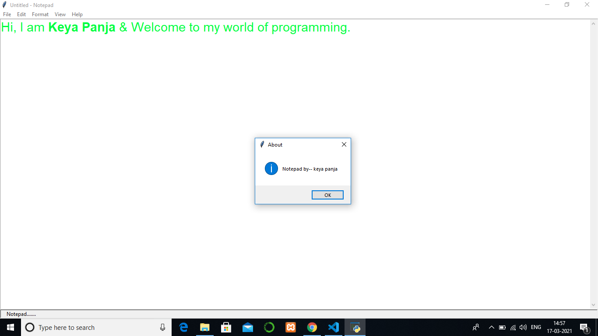

# Notepad(mini GUI project)
<pre>Notepad is a word processing program, which allows changing of text in a computer file.
It is a text editor, a very simple word processor.The program has options such as changing 
the font, the font size, and the font style. For more information <a href='https://en.wikipedia.org/wiki/Microsoft_Notepad'>click here</a> .</pre>

## Overview

## Download 
Please download all files . Click on  <a href='https://github.com/keya2000/Notepad/archive/master.zip' >Download</a> Button .

## Description
<pre>Run <b>keya_notepad.py</b> file to get the GUI Application . Used <b>File</b> ribbon to open
a file, create new file , Save current working file or Exit from notepad . Used <b> Edit </b> ribbon to 
perform edit realated task ( Cut/copy/paste) & <b>Format</b> ribbon to give a attractive look of your page.</pre>

## Contribution
<pre>Pull requests are always welcome. Please make sure that You have not any error before requesting. </pre> 
